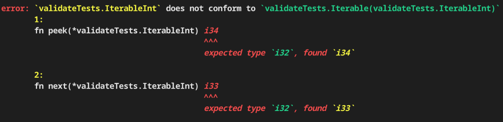

# Zig-Validate

### A type validation library for writing a zero-cost, declarative, understandable, generic code in zig.

---

> Note: minimum zig version 0.10.0 using the stage2 compiler is required to use zig-validate.

For many projects, the desired method of creating generic types is to do either of the following:

1. Use a concrete type that results in code bloat due to repetitiveness.
2. Use a concrete type that uses composition and hand-rolled vtables to emulate interfaces from other languages and incurring a runtime cost.
3. Use an `anytype` and have the caller of the function hope that sufficient documentation was written or comb through the codebase to see what methods are required.
4. Hand-roll type validation for a specific type every time a generic type is required.
5. Use a switch to hand-roll static dispatch in zig due to lack of function overloading.

*If only there was a way to have traits or interfaces in zig without having to waste time in repetitively writing error-prone imperative code for type validation...*

### Oh wait, __now there is!__

__Zig-Validate__ provides a non-obtrusive solution to all of those problems with a simple-to-use interface and a rich error reporting solution for relaying to the user issues with non-conforming generic types.

The following is a taste of the error-reporting capabilities of **Zig-Validate**:

---

### Static _and_ Dynamic dispatch?
Yes, static and dynamic dispatch implementations are available in __zig-validate__ with two different flavors of static dispatch!

For your statically-dispatched needs there is the more _vanilla_ `ValidateWith`, and the more powerful and ergonomic `validateWithMerged` that supports _function overloading_!

If you require a more _dynamic_ approach, there exists `utils.vtableify` to easily generate vtables!

> For more information on type validation using `zig-validate`, go to the [static dispatch](https://mov-rax.github.io/zig-validate/docs/StaticDispatch.md) and/or [dynamic dispatch](https://mov-rax.github.io/zig-validate/docs/DynamicDispatch.md) page(s).
 

### What if I have an existing application/library that would require too much refactoring to use the output type?

If you have a codebase that would require a large amount of refactoring to use the output type, then you can simply _not_ use the output type. Due to the unobtrusive nature of *zig-validate*, you can simply do `_ = ValidateWith(Target, Validator)` and still use the type validation power of the library. The only downside of discarding the output type is a generic trait/interface that is used to interact with generic `Target` types.

That's pretty much all that there is needed to know in order to use **zig-validate**! Now, stop writing boilerplate and bear witness to the power of **zig-validate**.

> Still unsure on how to use **zig-validate**? Then [Read zig-validate's documentation!](https://mov-rax.github.io/zig-validate/)